# Drone to hand delivery

This student project was created for the course "EE-490(g) Lab On Apps Development For Tablets, Smartphones And Smartwatches" at EPFL during the autumn semester of 2018. The app icon is shown below.

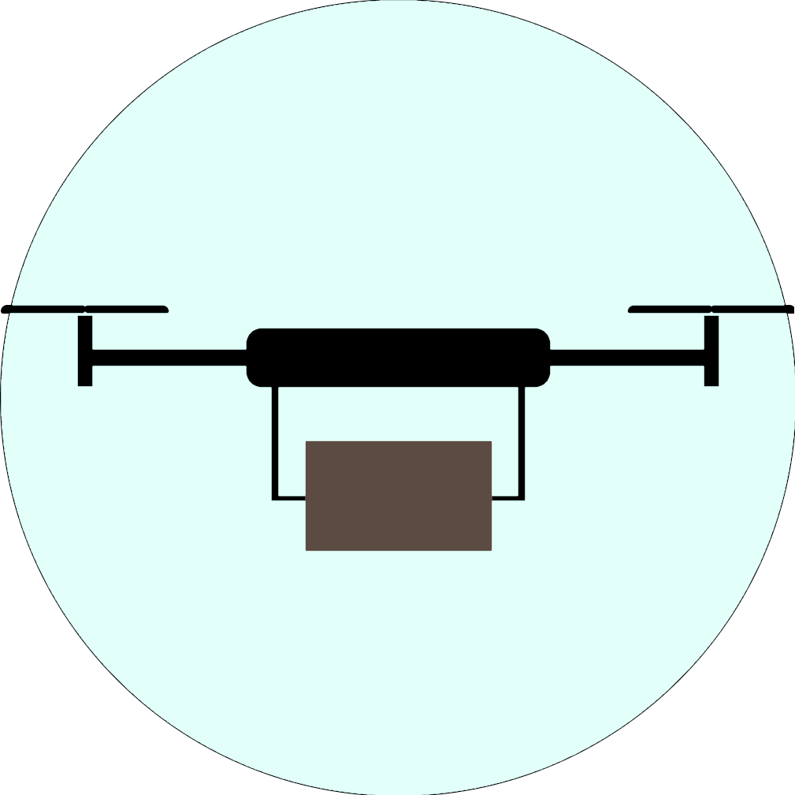

This one app allows users to send and receive packages if the sender has a Parrot ARD 3 drone. Both users can use any handheld Android device with an internet connection. Also, any of them can have an Android smartwatch connected (or both) and the watch-app will display real-time information of the delivery process if started. 

## Proof of concept

They start by creating new user accounts, or logging in using their existing ones.

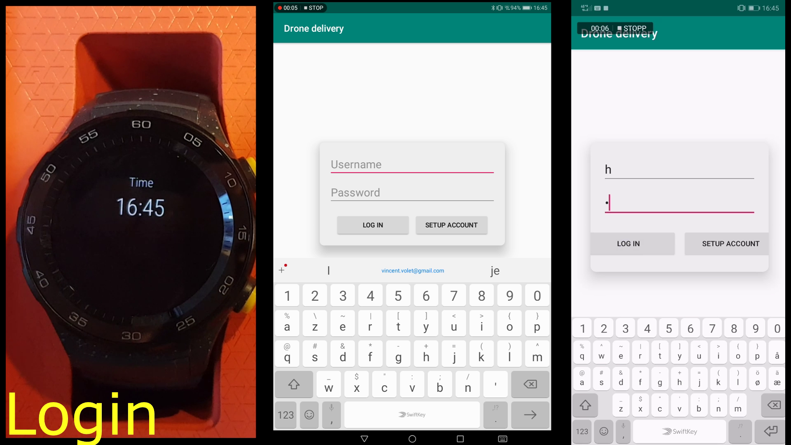

In this example, the device in the middle is the receiver and the one to the right is the sender. The receiver connects to the server and will appear in the list at the sender's screen, here under the username "r". (ETA does not work at this point).

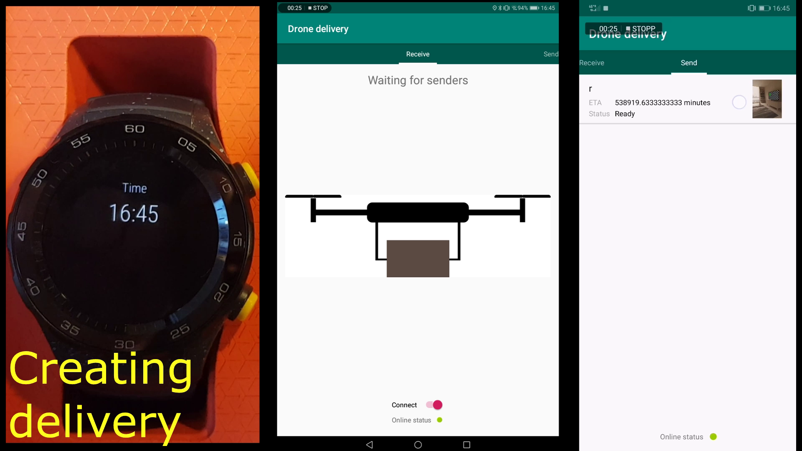

The sender creates a `delivery`-object that's uploaded to the cloud with information of the delivery. Name, quantity and a custom message.

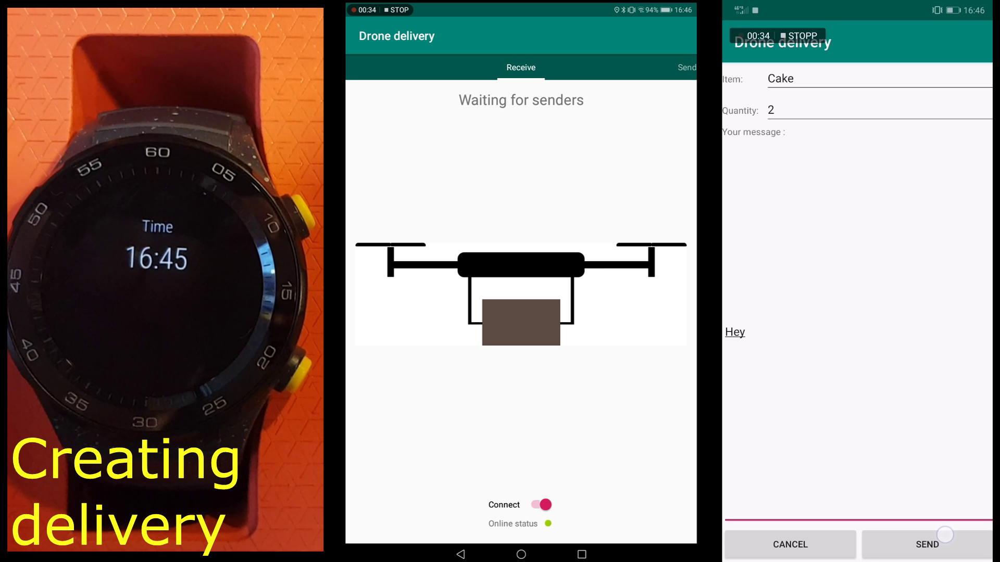

The receiver is alerted and can choose to accept the delivery. The sender waits.

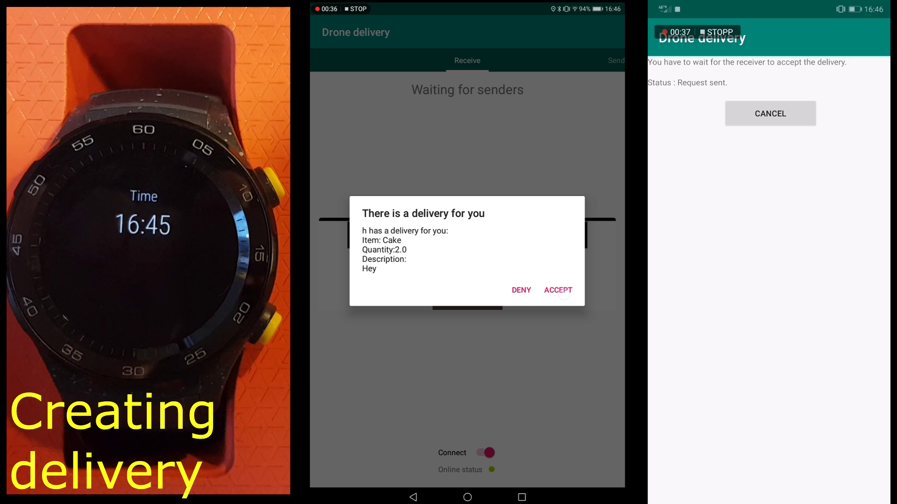

The sender connects to the drone, selects it from a list of available ones. Default coordinates of drone is 0,0. ETA is displayed on the watch.

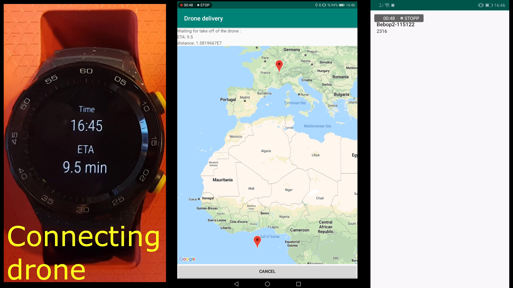

Drone is in flight towards the receiver. Both users can see the flight in realtime, in addition to ETA and remaining distance to target. Both can cancel at any time.

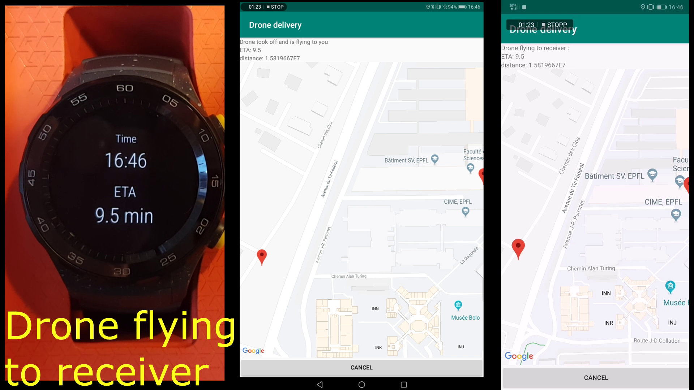

The receiver is alerted when the drone is within reach, and it will track and follow the receiver until asked to land (so it won't land in water/buildings/anyone's hair. 

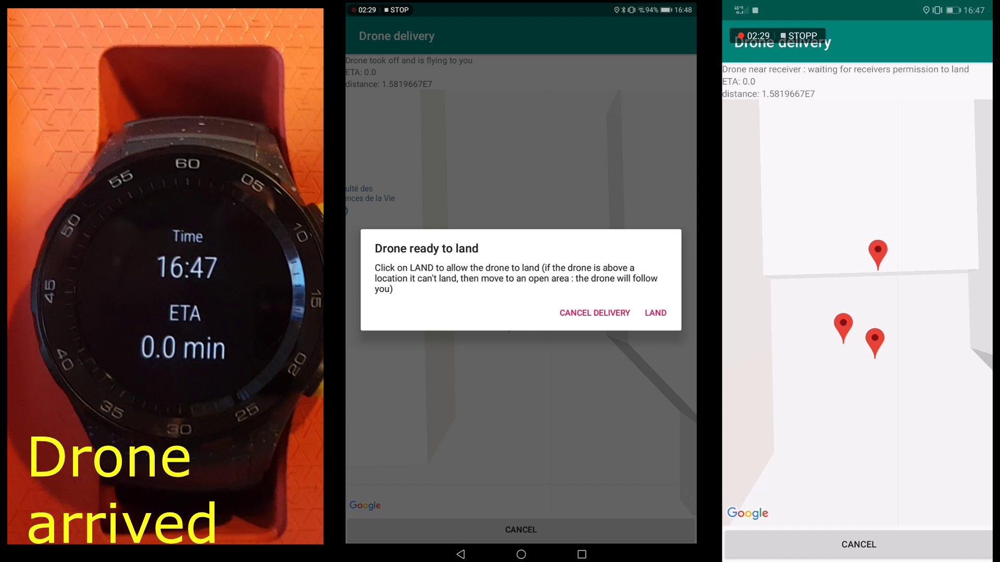

When landed, it will ask the receiver permission to take off and fly back to the sender, after the package is unloaded.

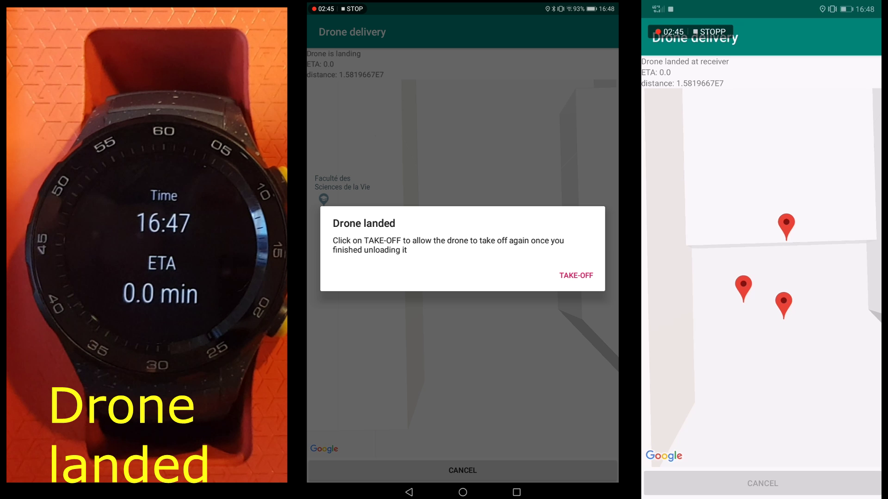

## Technicalities

The app/activity structure is visualized in the figure below.

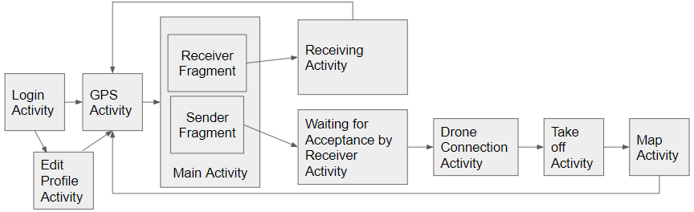

A map of the used APIs and data mangement (cloud) for each activity is shown below.

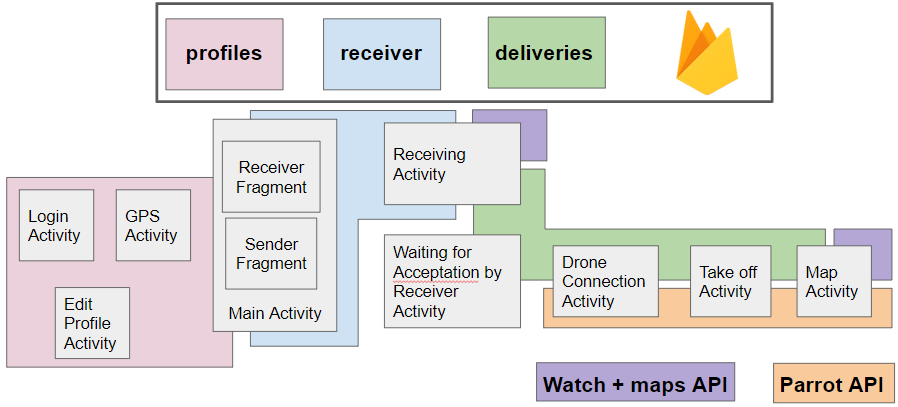

The app was developed and tested for the newest versions of Android at the time, namely Android Pie and Wear OS 2.0. The project serves as a proof-of-concept and does not fully work. This is because of the assumption of that the sender can be connected to both the drone (over WiFi) and the internet for the cloud services, which is impossible with the drone chosen. If one were to connect to the drone over eg. BLE, this would not be a problem. 
